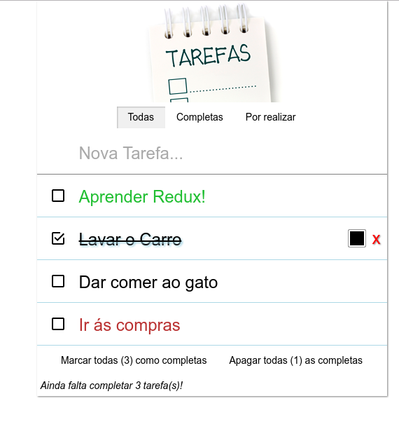

#Lista de Tarefas
Simples applicação feita em React e Backbone.
Usa Scss para estilo e webpack para transformar e combinar todo o codigo.

####Permite:
- Adicionar items á lista
- Remover items
- Editar items
- Marcar "como feito" (sendo uma lista de tarefas)

####Utilização
 - Instalar dependencias `npm install`
 - Instalar webpack `npm install -g webpack`
 - Instalar webpack-dev-server `npm install -g webpack-dev-server`
 - Correr o webpack-devserver `webpack-dev-server`
 - Abrir o browser no endereço http://localhost:8080

####Exemplo
